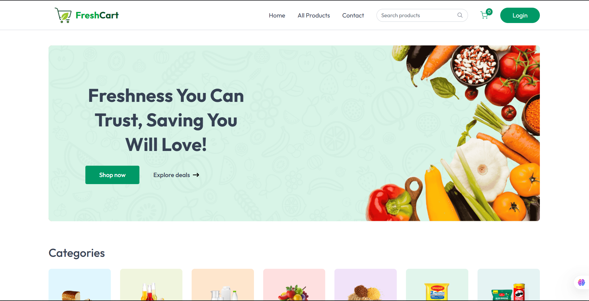
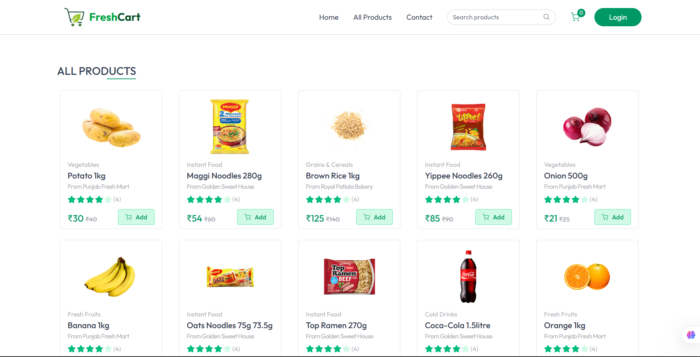
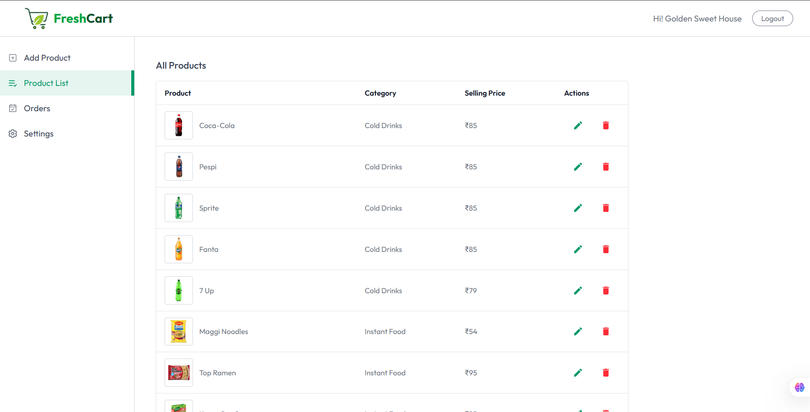
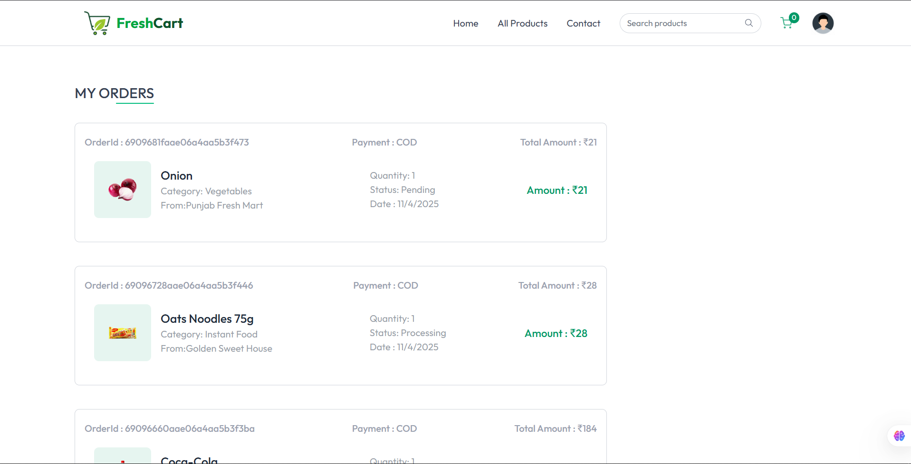
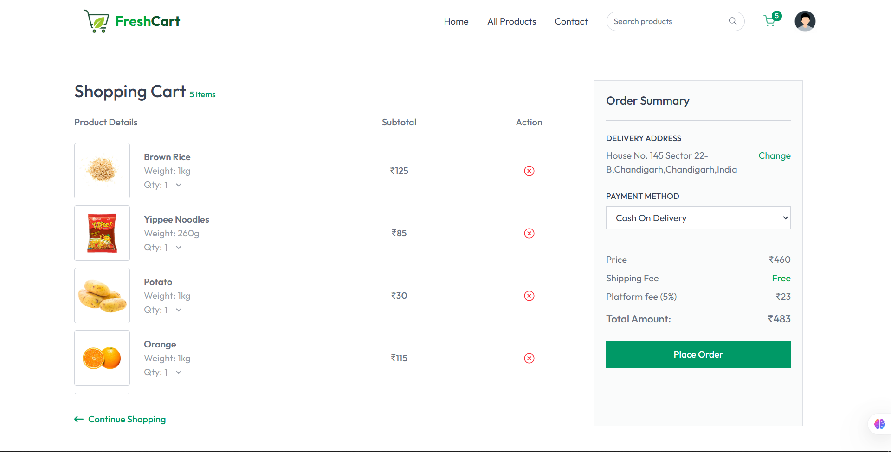
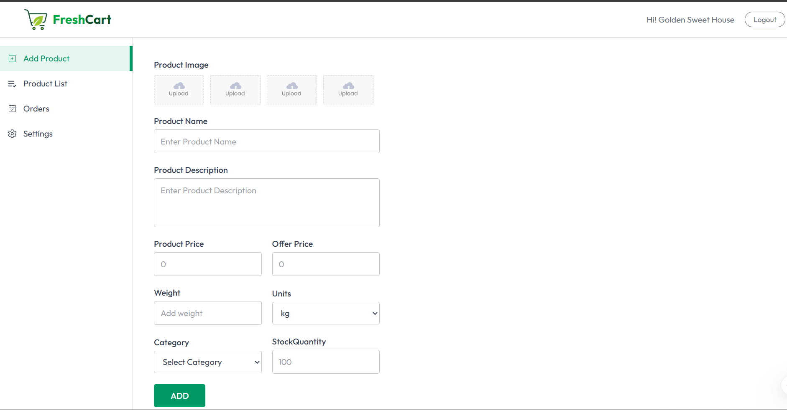
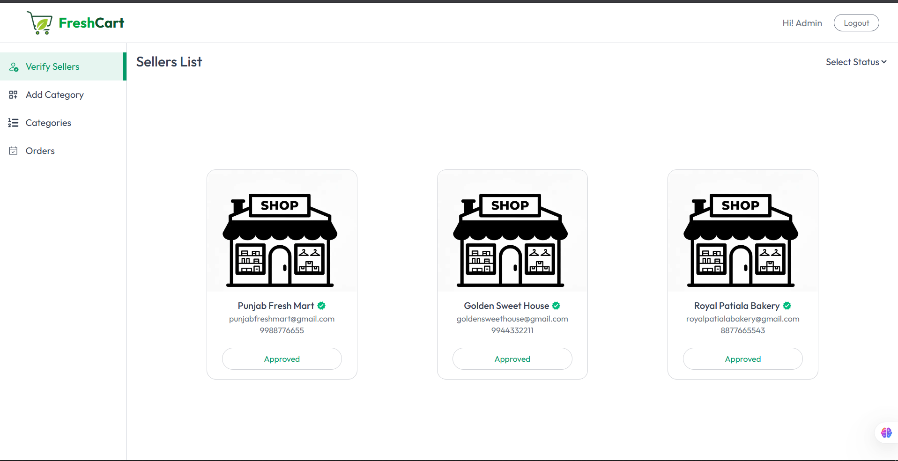

# 🥦 FreshCart - Full Stack Grocery Marketplace

<p align="center">
  
  
  
  
  
  
  
  
  
  
  
  
  
</p>

<p align="center">
  
  
  
</p>

Welcome to the complete monorepo for **FreshCart**, a production-ready, full-stack grocery marketplace.  
This MERN stack system is designed to be **scalable, secure, and feature-rich**, supporting 3 major user roles.

---

## 🧩 Architecture

This repository contains two primary applications:

| Folder      | Description                                     |
| ----------- | ----------------------------------------------- |
| `/Backend`  | Backend REST API (Node.js + Express + MongoDB)  |
| `/Frontend` | Frontend SPA (React + Redux Toolkit + Tailwind) |

---

## 📸 Screenshots

# 🏠 Home Page



---

# 🛍️ All Products Page



---

# 🏪 Seller Dashboard — Product Management



---

# 📦 Customer — My Orders



---

## 👥 User Roles

| Role            | Description                                                   |
| --------------- | ------------------------------------------------------------- |
| 🛒 **Customer** | Browse, filter, purchase products, manage cart, checkout      |
| 🏪 **Seller**   | Manage product listings, inventory, and order fulfillment     |
| 🛠 **Admin**     | Approve sellers, manage categories, oversee platform activity |

---

## ✨ Key Features

### ✅ Customer-Facing Features

- Persistent hybrid cart (localStorage + DB)
- Instant client-side filtering & search
- Multi-step secure checkout
- Order history & item-level status tracking
- Full address CRUD system

### ✅ Seller Dashboard

- Role-based protected dashboard
- Seller approval flow (pending → approved)
- Full product CRUD with separate image endpoint
- Order panel — sees only their own items
- Update order item statuses

### ✅ Admin Dashboard

- Stateless admin login
- Approve/Reject seller applications
- Category CRUD with validation & image support
- Full marketplace order access and overrides

### ✅ Core Technical Features

- JWT access + refresh tokens (Secure httpOnly cookies)
- Isolated role-based auth flows
- Automatic Axios token refresh & retry
- Cloudinary media storage w/ cleanup logic
- Atomic stock decrementing with MongoDB `$inc`
- Order data snapshot (immutable history)
- Redux Toolkit for scalable state management

---

## 📸 UI Previews

| Page             | Screenshot                              |
| ---------------- | --------------------------------------- |
| Cart & Checkout  |              |
| My Orders        |       |
| Seller Dashboard |  |
| Admin Panel      |       |

---

## 🧰 Full Tech Stack

### Frontend `/Frontend`

| Technology      | Purpose                     |
| --------------- | --------------------------- |
| React 18 + Vite | UI Framework                |
| React Router v6 | Routing & layouts           |
| Redux Toolkit   | Global state                |
| Axios           | API requests + interceptors |
| Tailwind CSS    | Styling                     |
| React-Hot-Toast | Notifications               |
| React Icons     | Icons                       |

---

### Backend `/Backend`

| Technology             | Purpose                  |
| ---------------------- | ------------------------ |
| Node.js + Express      | API server               |
| MongoDB + Mongoose     | Database                 |
| JWT + bcrypt.js        | Authentication + hashing |
| Cloudinary             | Media storage            |
| Multer                 | File uploads             |
| Joi                    | Validation               |
| cookie-parser / dotenv | Essential middleware     |

---

## 📁 Folder Structure

### Backend `/Backend`

```bash
/Backend
└── src/
    ├── config/         # (cloudinary, cors)
    ├── constants/      # (db_name)
    ├── controllers/    # (user.controller.js, etc.)
    ├── db/             # (Database connection)
    ├── middlewares/    # (auth, multer, validation)
    ├── models/         # (user.model.js, etc.)
    ├── routes/         # (user.route.js, etc.)
    ├── utils/          # (ApiError, ApiResponse, etc.)
    ├── app.js          # (Express app setup)
    └── index.js        # (Server entry point)
```

### Frontend `/Frontend`

```bash
/Frontend
└── src/
    ├── api/            # (userApi, sellerApi, adminApi)
    ├── app/            # (Redux store.js)
    ├── assets/         # (images, icons)
    ├── components/     # (Navbar, Footer, ProductCard)
    ├── context/        # (AppContext.jsx for toast/navigate)
    ├── features/       # (Redux Slices: auth, cart, product, ui)
    ├── pages/          # (Home, Cart, Admin, Seller pages)
    ├── App.jsx         # (Main router setup)
    └── main.jsx        # (React entry point)
```

---

## ⚙️ Local Setup & Installation

### 1️⃣ Backend Setup (`/Backend`)

```bash
cd Backend
npm install
```

Create a `.env` file:

```bash
PORT=8000
CORS_ORIGIN=http://localhost:5173

MONGODB_URI=your_connection_string_here

ACCESS_TOKEN_SECRET=...
REFRESH_TOKEN_SECRET=...
ADMIN_TOKEN_SECRET=...

ADMIN_EMAIL=admin@freshcart.com
ADMIN_PASSWORD_HASH=hashed_password_here

CLOUDINARY_CLOUD_NAME=
CLOUDINARY_API_KEY=
CLOUDINARY_API_SECRET=
```

Start Backend:

```bash
npm run dev
```

✅ Backend running at: http://localhost:8000

### 2️⃣ Frontend Setup (`/Frontend`)

```bash
cd Frontend
npm install
```

Add `vite.config.js`:

```bash
import { defineConfig } from 'vite';
import react from '@vitejs/plugin-react';

export default defineConfig({
  plugins: [react()],
  server: {
    proxy: {
      "/api/v1": {
        target: "http://localhost:8000",
        changeOrigin: true,
      },
    },
    port: 5173,
  },
});
```

Start frontend:

```bash
npm run dev
```

✅ Frontend running at: http://localhost:5173

### 🚀 Activation Steps (Full Flow)

| Step                     | Action                         |
| ------------------------ | ------------------------------ |
| 1️⃣ Run API & Frontend    | start dev servers              |
| 2️⃣ Admin Login           | `/admin` with .env credentials |
| 3️⃣ Register Seller       | `/seller` register             |
| 4️⃣ Admin Approves Seller | admin dashboard                |
| 5️⃣ Seller Adds Product   | seller dashboard               |
| 6️⃣ Customer Shops        | browse → cart → order          |
| 7️⃣ ✅ Order completes    | cart merges + stock decrements |

---

## 🎯 Summary

FreshCart is a production-grade MERN platform that includes:

✔ Multi-role authentication
✔ Cloud storage & cleanup
✔ Atomic stock handling
✔ Full CRUD admin dashboard
✔ Seller onboarding workflow
✔ Persistent real-time cart logic

---

## 📄 License

ISC License © Jashan Maan
